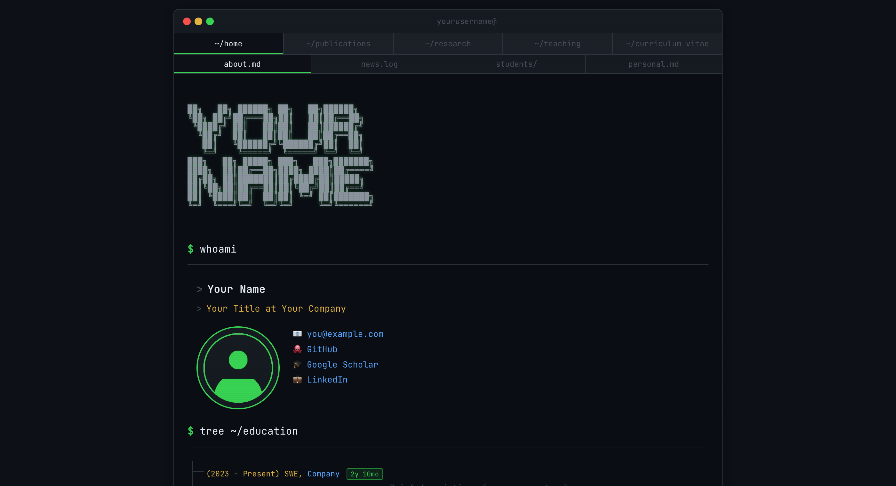

<h1 align="center">
  <br>
  <code>>_ term-folio</code>
  <br>
</h1>

<p align="center">
  <strong>A terminal-themed Jekyll portfolio for developers & researchers</strong>
</p>

<p align="center">
  <a href="https://idrissrio.github.io" target="_blank">Live Demo</a> •
  <a href="#features">Features</a> •
  <a href="#quick-start">Quick Start</a> •
  <a href="#customization">Customization</a> •
  <a href="#deployment">Deployment</a> •
  <a href="#file-structure">File Structure</a> •
  <a href="#credits">Credits</a>
</p>

---

<p align="center">
  
</p>

---

## Features

- **Terminal aesthetic** — dark background, monospace font, command prompts, blinking cursors
- **iTerm2-style tabs** — site navigation styled as terminal tabs
- **Typing animation** — command prompts type out when scrolled into view
- **Interactive map** — Leaflet.js map with dark tiles and glowing pins for your places
- **Lightbox gallery** — custom photo gallery with keyboard navigation
- **Skill bars** — terminal-styled progress bars for languages and coding skills
- **Tree views** — `tree`-command styled education/experience timelines with auto-calculated durations
- **ASCII art** — large monospace name banner on the homepage
- **Jekyll Scholar** — full BibTeX bibliography support for publications
- **SEO optimized** — sitemap, Open Graph, Twitter Cards, JSON-LD structured data
- **No Bootstrap, no jQuery** — pure custom CSS (~600 lines), minimal vanilla JS
- **Responsive** — works on mobile with graceful terminal scaling
- **Dark mode only** — GitHub's dark color palette (`#0d1117`)

## Quick Start

### Prerequisites

- [Ruby](https://www.ruby-lang.org/) ≥ 2.7
- [Bundler](https://bundler.io/) (`gem install bundler`)

### 1. Use this template

Click **"Use this template"** on GitHub, or clone directly:

```bash
git clone https://github.com/IdrissRio/term-folio.git my-site
cd my-site
```

### 2. Install dependencies

```bash
bundle install
```

### 3. Customize your content

Edit these files with your info (see [Customization](#customization) below):

| File | What to edit |
|------|-------------|
| `_config.yml` | Name, email, URLs, social links, analytics |
| `_data/pi.yml` | Photo, bio, education timeline |
| `_data/news.yml` | News/blog entries |
| `_data/cv.yml` | Full CV data |
| `_data/people.yml` | Supervised students |
| `_pages/about.md` | Homepage content, ASCII art, about text |
| `_pages/research.md` | Research projects |
| `_pages/teaching.md` | Teaching experience |
| `_pages/curriculum.md` | Skills, languages |
| `assets/ref.bib` | BibTeX publications |

### 4. Run locally

```bash
bundle exec jekyll serve
```

Open [http://localhost:4000](http://localhost:4000) 🎉

## Customization

### Identity (`_config.yml`)

```yaml
title: Your Name
email: you@example.com
url: "https://yourusername.github.io"
username: yourusername          # shown as "username@" in terminal
github_url: https://github.com/yourusername
scholar_url: https://scholar.google.com/citations?user=XXXXX
linkedin_url: https://www.linkedin.com/in/yourusername
```

### ASCII Art Name

Replace the ASCII art in `_pages/about.md` with your name. Generate one at:
- [patorjk.com/software/taag](https://patorjk.com/software/taag/) (use "ANSI Shadow" font)

### Colors

Edit CSS variables in `_sass/_base.scss`:

```scss
:root {
  --bg-primary: #0d1117;     // main background
  --bg-secondary: #161b22;   // terminal body
  --green: #39d353;           // primary accent
  --amber: #e3b341;           // secondary accent
  --blue: #58a6ff;            // links
  --red: #f85149;             // errors
  --purple: #bc8cff;          // highlights
  --cyan: #39c5cf;            // terminal prompt
}
```

### Navigation Tabs

Edit `nav_pages` in `_config.yml`:

```yaml
nav_pages:
  - name: publications
  - name: research
  - name: teaching
  - name: curriculum
```

### Homepage Sub-tabs

Edit `_layouts/homelay.html` to add/remove content tabs (about, news, students, personal).

### Places Map

In `_pages/about.md`, update the places tree and add map pins in `assets/js/terminal.js` (search for `L.marker`).

### Favicon

Replace `favicon.svg` and `favicon.ico` with your own. The default is a terminal icon with a green `>_` prompt.

### Publications

Add your BibTeX entries to `assets/ref.bib`. The publications page uses [jekyll-scholar](https://github.com/inukshuk/jekyll-scholar) to render them automatically.

## Deployment

### GitHub Pages (recommended)

1. **Create a GitHub Pages repo**: `yourusername.github.io`

2. **Update the Rakefile** with your repo URL:
   ```ruby
   GITHUB_PAGES_REPO = "https://github.com/yourusername/yourusername.github.io.git"
   ```

3. **Build and deploy**:
   ```bash
   rake publish
   ```

   This builds the site and force-pushes to your GitHub Pages repo.

4. **Custom domain** (optional): Add a `CNAME` file with your domain name.

### Alternative: GitHub Actions

You can also deploy using GitHub Actions by pushing the source to a `source` branch and using a workflow to build and deploy.

## File Structure

```
_config.yml              # Site settings, navigation, plugins
_data/
  cv.yml                 # CV data (education, experience, awards)
  news.yml               # News entries with optional images
  people.yml             # Supervised students
  pi.yml                 # Personal info, photo, education timeline
_includes/
  analytics.html         # Google Analytics
  footer.html            # Footer + lightbox + JS loader
  head.html              # <head> with fonts, CSS, meta tags
_layouts/
  default.html           # Base layout
  gridlay.html           # Standard page layout (terminal + nav tabs)
  homelay.html           # Homepage layout (nav tabs + content sub-tabs)
_pages/
  about.md               # Homepage (ASCII art, whoami, news, students, personal)
  allnews.md             # All news archive
  curriculum.md           # CV page (skills, languages, timeline)
  publications.md        # Publications (jekyll-scholar)
  research.md            # Research projects
  teaching.md            # Teaching experience
  404.md                 # Terminal-styled 404 page
_sass/
  _animations.scss       # Typing animation, blinking cursor
  _base.scss             # Colors, reset, typography
  _components.scss       # Tags, badges, skill bars
  _layout.scss           # Page structure, footer
  _terminal.scss         # Terminal chrome, tabs, trees, map
assets/
  main.scss              # SCSS entry point
  js/terminal.js         # All client-side JS
  ref.bib                # BibTeX bibliography
images/
  teampic/               # Your profile photo
  news/                  # News images
```

## Technical Notes

- **Kramdown + HTML**: HTML inside `.md` files must NOT be indented 4+ spaces (Kramdown treats that as a code block). Keep all HTML left-aligned.
- **Skill bars**: Wrap skill bar HTML in a `<div markdown="0">` to prevent Kramdown from wrapping elements in `<p>` tags.
- **Leaflet**: The map lazy-loads only when the "personal" tab is first clicked.
- **Typing animation**: Uses `IntersectionObserver`. Text is stored in `data-text` attributes and typed character-by-character.

## License

MIT — use it freely for your personal or academic website.

## Credits

- Design inspired by terminal emulators and the GitHub dark theme
- Font: [JetBrains Mono](https://www.jetbrains.com/lp/mono/)
- Map: [Leaflet.js](https://leafletjs.com/) with [CartoDB Dark Matter](https://carto.com/basemaps/) tiles
- Bibliography: [jekyll-scholar](https://github.com/inukshuk/jekyll-scholar)
- Built with [Jekyll](https://jekyllrb.com/)


